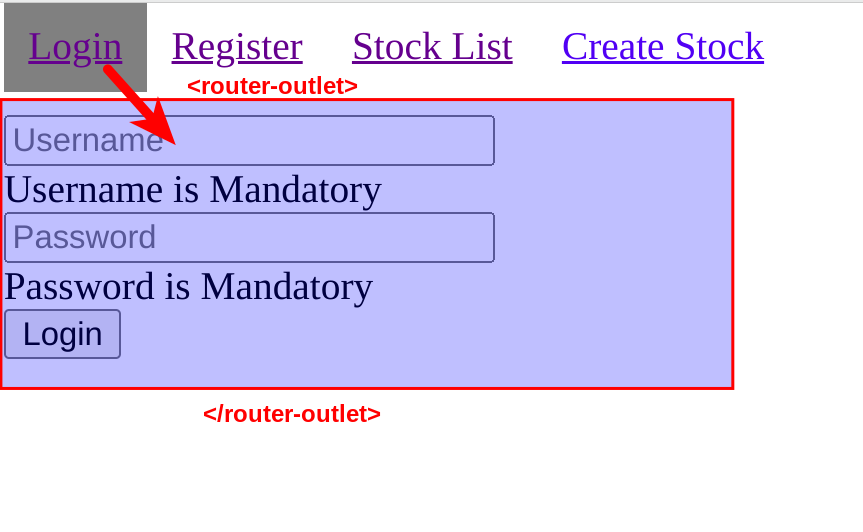
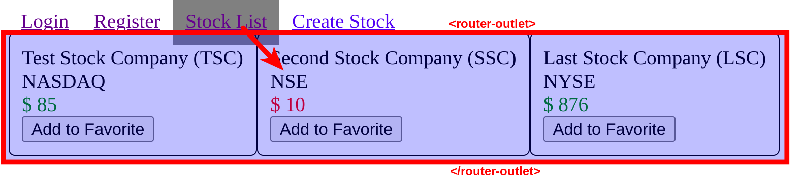
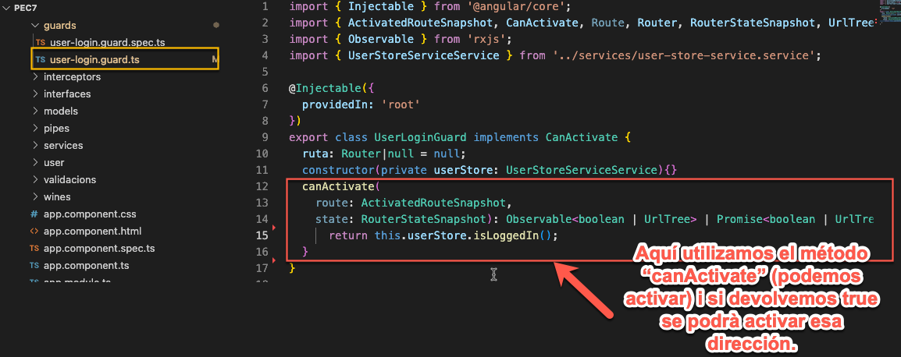
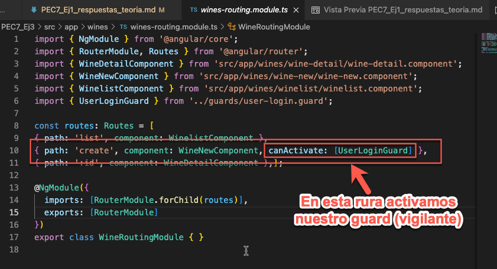
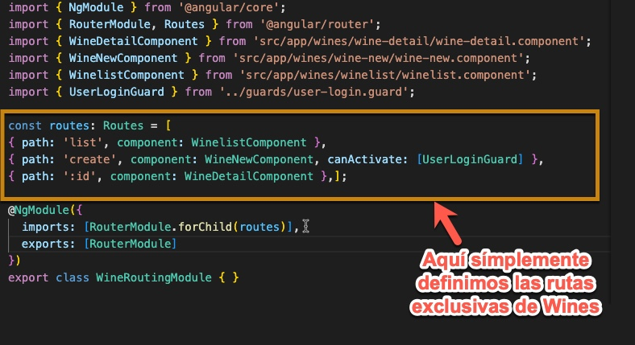
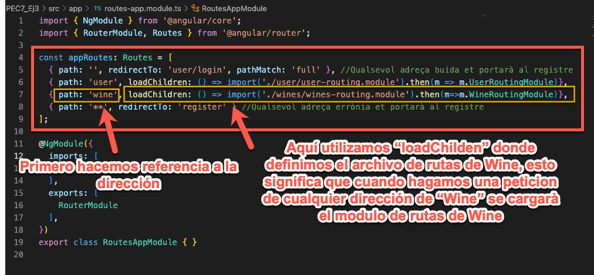

# ¿Qué es y cómo funciona el elemento \<RouterOutlet>?
**\<router-outlet>** es una etiqueta especial que contiene angular donde mostrará el contenido de las páginas enrutadas, o sea, si la ruta es lista de vinos en la sección **\<router-outlet>** nos mostrará la lista de vinos, si cambiamos a registro de usuarios, nos mostraría la información del componente enrutado resgitro de usuario.
~~~

  <a routerLink="/login" routerLinkActive="active">Login</a>
  <a routerLink="/register" routerLinkActive="active">Register</a>
  <a routerLink="/stocks/list" routerLinkActive="active">Stock List</a>
  <a routerLink="/stocks/create" routerLinkActive="active">Create Stock</a>

<router-outlet></router-outlet>
~~~

# ¿Para qué se utilizan las directivas routerLink y routerLinkActive? ¿Existen más directivas relacionadas con el router?

Normalmente para crear un enlace utilizamos la etiqueta **\<a>** pero al realizar una pàgina tipo SPA no es del todo correcto porqué cada vez que damos a un enlace obligamos a cargar la página entera.
Angular ofrece una solución, en vez de utilizar la etiqueta **\<a>**, utilizamos la etiqueta **\<routerlink>** hace la misma fiunción que la **\<a>** pero no obliga a recargar de nuevo la página.
También existe **routeractivelink** que podemos asociar una clase CSS para decorar un link activo.

**RouterLinkWithHref**

# ¿Qué diferencias hay entre los servicios Router y ActivatedRoute? ¿Qué funcionalidades tiene cada uno de estos servicios? Describe algunos de los métodos más importantes por los que están compuestos.

Los **ActivatedRoute** nos permite saber que servicio está activo y podemos recuperar información como los parámetros pasados.

# ¿Qué son las Route Guards? ¿Cómo se usan las guardas en Angular? Describe todas las guardas que existen en Angular (consulta para ello la documentación oficial de Angular)

Las **guards** sirven para protejer ciertas rutas o eventos producidos por un cambio de ruta de nuestro proyecto, vamos a ver un ejemplo sencillo:

## El primer paso serà generar un **guard**

~~~
ng g guard guards/user-login
~~~

Aquí nos pide información adicional sobre que tipo de guard queremos realizar:
* canActivate: Nos permite vigilar la activación de una URL.
* canActivateChild: Nos permite vigilar la carga de una ruta hija.
* canDeactivate: Nos vigilará si intentamos salir de una página, muy útil para los formularios.
* canLoad: Vigilará la carga de una página.

Esto genera un archivo y su archivo de control, vamos a ver como configuramos el guard generado.

Nosotros haremos un ejemplo que vigile la entrada a una URL, **canActivate**

Ahora para activar este guard en una rura lo haremos de la siguiente manera:

# ¿Qué es la carga Lazy de los módulos de Angular? ¿Cómo se configura en Angular la carga Lazy?

La carga lazy o perezosa nos permite optimizar la carga de nuestra aplicación, debido a que se cargan las partes cuando se soliciten.
Por defecto, angular carga todas las dependencias al cargar la aplicación, si la aplicación es muy grande podemos tener problemas de rendimiento, para eso se crean las rutas *hijas*, vamos a ver el siguiente ejemplo:

lo primero serà crear modulos y rutas para separar partes de nuestra aplicación, por ejemplo, la parte de *usuarios* y la parte de *vinos*.

~~~~
ng generate module Wines --routing
~~~~

Esto genera un nuevo modulo y el fichero de rutas

Ahora vamos a configurar el fichero de rutas de **Wines**, **wines-routing.module.ts**

Todo seguido tenemos un archivo de rutas principal **routes-app-module.ts** 

# ¿Qué es/para qué son útiles los middlewares en el contexto de node.js? ¿Dónde estás usando middlewares en nuestra aplicación?

Un middleware es una función que se puede ejecutar antes o después del manejo de una ruta. Esta función tiene acceso al objeto Request, Response y la función next().

fuente: https://medium.com/@aarnlpezsosa/middleware-en-express-js-5ef947d668b#:~:text=Un%20middleware%20es%20una%20funci%C3%B3n%20que%20se%20puede%20ejecutar%20antes,y%20la%20funci%C3%B3n%20next().
